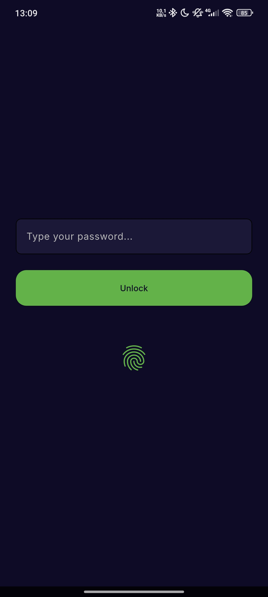
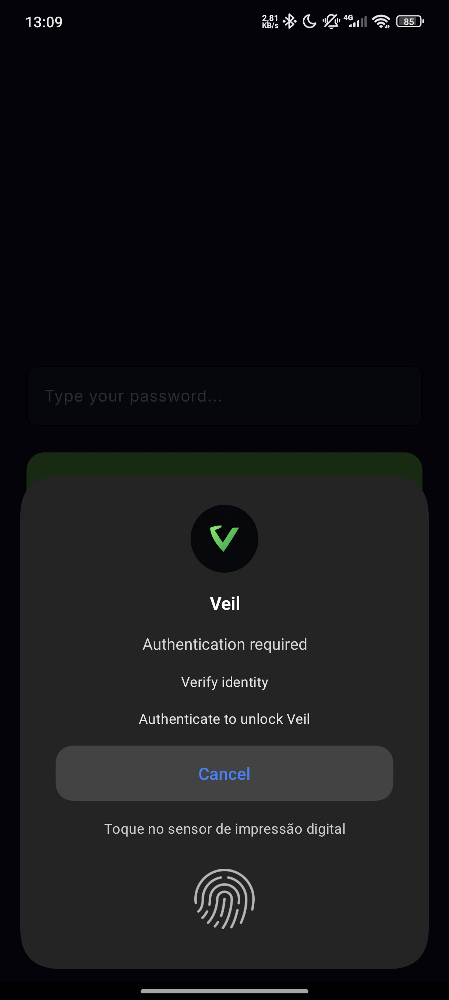
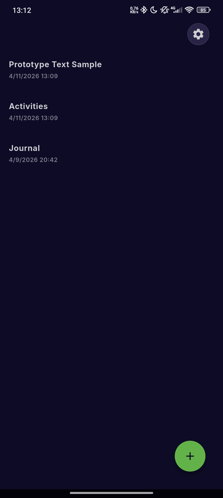
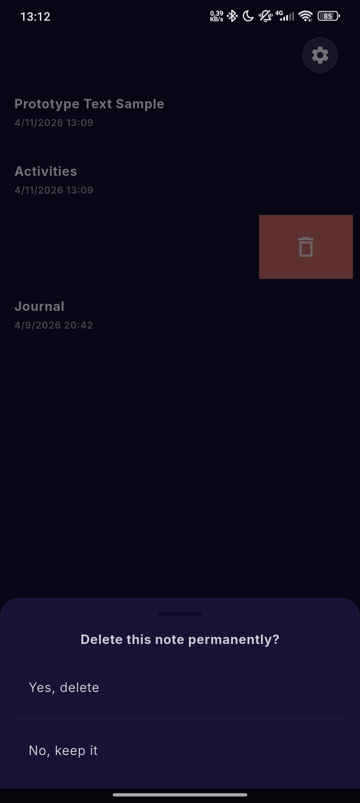
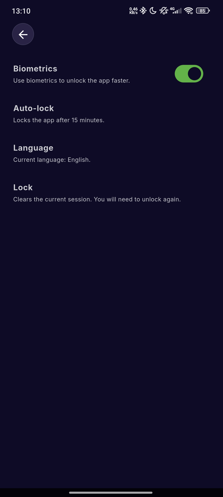
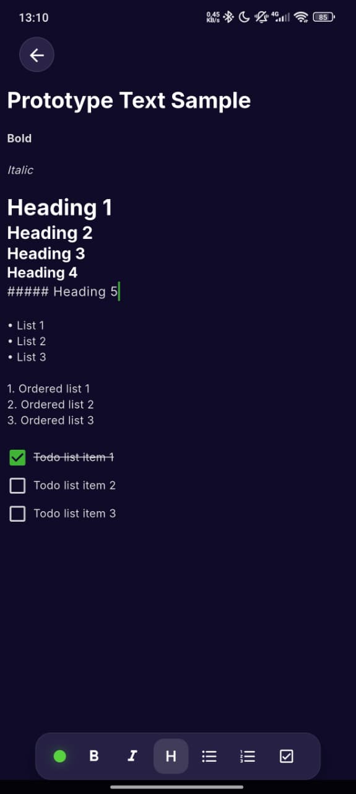

# Veil

**Privacy without effort.**

Veil is an Android-first encrypted notes app focused on local storage, clear ownership of data, and a fast writing experience.

## What Veil Is

Veil stores your notes on your device as encrypted `.pgp` files.

- OpenPGP-based encryption
- Local-first note storage
- No account required
- No cloud sync by default
- No analytics or tracking in the app

Your notes stay on your device and are encrypted locally.

## Current Features

- Local encrypted notes
- Master password setup and unlock
- Optional biometric unlock
- Markdown editor with checklist support
- Auto-lock timeout
- Multi-language interface

## Screenshots

Some Veil features screenshots.

 

## Project Status

Veil is currently in **early development**.

This public repository is used for releases, notes, and user feedback while the source code remains private during early development.

## Download

If public builds are available, they will appear in the **Releases** section of this repository.

## Security Notice

- Your password cannot be recovered
- Losing access to your password means losing access to your notes
- The app has not been security-audited yet
- Use current builds with non-critical data until the project matures

## Current Limitations

- No cloud sync
- No import/export flow in the app yet
- No password recovery

## Feedback

If you test a build and run into a problem, open an issue with:

- device model
- Android version
- app version
- steps to reproduce

## Philosophy

Veil is built around a simple rule:

> Your notes should belong to you always.
